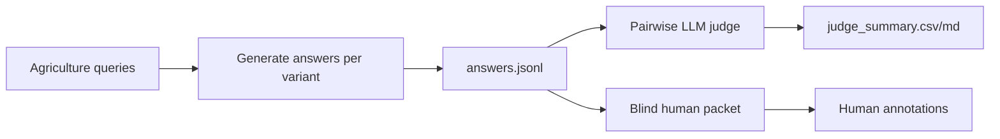
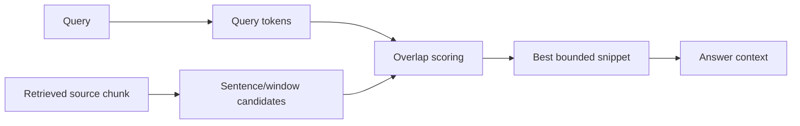

# Retrieval Experiment Notes

Date: 2026-05-04

This file keeps the concrete experiment design separate from the higher-level plan in `docs/NEXT_STEPS.md`.

## Baseline To Preserve

The current `hi` retrieval path in `src/hirag/_op.py` should be preserved as the control.

Behavior to compare against:

- dense entity retrieval: `entities_vdb.query(query, top_k=top_k * 10)`
- local context: first `top_k` entity nodes
- global context: community reports attached to local entities
- key entities: top retrieved entities that are members of each selected community
- bridge: one unweighted shortest-path chain through deduplicated key entities

Implemented control note:

- `hi` remains the baseline full-context mode.
- The only intentional control-path cleanup is deterministic ordered deduplication for key entities.

## Experiment A: Query-Weighted Bridge

Goal:

- make bridge paths prefer relations that are semantically relevant to the query

Candidate edge text:

```text
source entity name
source entity description
edge description
target entity name
target entity description
```

Cost sketch:

```text
semantic_cost = 1 - cosine(embed(query), embed(edge_text))
hub_cost = log(1 + degree(source) + degree(target))
relation_cost = 1 / log(2 + edge_weight)
cost = alpha * semantic_cost + beta * hub_cost + gamma * relation_cost
```

Initial weights:

```text
alpha = 1.0
beta = 0.15
gamma = 0.05
```

Implementation note:

- precompute edge texts lazily per query
- use the existing embedding function for query and edge text batches
- call `nx.shortest_path(graph, source, target, weight=weight_fn)` or `nx.dijkstra_path`
- for Neo4j, prototype in NetworkX first; port Cypher/GDS later only if needed

Measurements:

- path node count
- path edge count
- mean edge semantic score
- max edge semantic cost
- number of high-degree hubs used
- context token count
- query latency

## Experiment B: Minmax Bridge

Goal:

- avoid paths where one very bad edge joins otherwise good context

Idea:

- score every candidate edge with the query-conditioned cost
- find a path minimizing the maximum edge cost

Simple implementation:

- sort unique edge costs
- binary search a threshold
- keep only edges with cost <= threshold
- find the first threshold where source and target are connected
- among threshold-valid paths, choose shortest length

Why this may help:

- bridge context quality can be damaged by a single unrelated generic edge
- minmax makes the path conservative about worst-edge relevance

## Experiment C: A* Bridge

Use only if weighted Dijkstra is too slow.

Possible heuristic:

```text
h(node, target) = 1 - cosine(embed(query), embed(node_description + target_description))
```

Caution:

- this heuristic is probably not admissible
- that is acceptable for retrieval ranking, but we should not claim classical optimality

## Experiment D: MCTS Bridge

Do not implement first.

Possible action space:

- expand from current node to one neighbor
- stop when target reached or budget exhausted

Reward:

- query relevance of edge text
- reaching target
- path compactness
- penalty for generic hubs

Why it is risky now:

- many hyperparameters
- expensive per query
- hard to evaluate with the current query budget

Keep this for discussion or future work.

## Experiment E: Local Retrieval Reranking

Goal:

- improve the top local entities that seed community and bridge retrieval

Candidate generation:

- keep existing dense entity retrieval with `top_k * 10` or `top_k * 20`

Reranking options:

- ColBERT late interaction over entity text
- cross-encoder reranker
- FastEmbed reranker if dependency friction is lower

Implemented v1:

- `fastembed.LateInteractionTextEmbedding`
- default model: `answerdotai/answerai-colbert-small-v1`
- dense entity search remains candidate generation
- reranked entities feed the same local/global/bridge context builder
- if model initialization or embedding fails, retrieval logs a warning and preserves dense ordering

Entity text:

```text
{entity_name}
type: {entity_type}
description: {description}
```

Metrics:

- overlap with baseline top entities
- source chunk coverage
- answer/context quality on the same query set
- added latency

## Experiment F: Bridge Coverage Diagnostic

The paper reports token-level recall between bridge context and local/global context. We can implement a cheaper diagnostic:

- tokenize local entity descriptions
- tokenize community reports
- tokenize bridge relation descriptions
- compute token overlap ratios after stopword filtering

This is not a full quality metric, but it helps verify whether the bridge is actually connecting both sides rather than adding unrelated path text.

## Small Query Set

Start with:

- 10 original agriculture queries if the QA JSONL is present
- 5 hand-written graph-inspection queries

Run every retrieval variant on exactly the same query set.

Recommended first outputs:

- one JSONL record per query/variant
- one markdown qualitative report with 3-5 representative cases
- one CSV summary for path/context metrics

## Implemented Modes

The active experimental modes are:

- `hi`: baseline HiRAG.
- `hi_weighted`: baseline local retrieval plus query-weighted bridge paths.
- `hi_minmax`: baseline local retrieval plus minmax bridge paths.
- `hi_minmax_budgeted`: minmax bridge paths with per-segment and total bridge edge budgets.
- `hi_rerank`: FastEmbed late-interaction local reranking plus baseline bridge.
- `hi_rerank_weighted`: reranked local retrieval plus query-weighted bridge paths.

## Answer-Level Evaluation Harness

Agriculture has 100 queries, but the checked-in `agriculture_query.jsonl` does not include ground-truth answers. For this dataset, the answer-level loop is therefore:



Implemented scripts:

- `eval/answer_generation_benchmark.py`: runs selected HiRAG modes with `only_need_context=False` and writes resumable `answers.jsonl`.
- `eval/pairwise_answer_judge.py`: compares generated answers through an OpenAI-compatible judge, using swapped answer order to reduce positional bias.
- `eval/build_human_annotation_packet.py`: creates blind `Answer A/B/...` annotation packets for humans.

The answer harness now discovers the local model context window even when `--chat-model` is provided, and uses conservative context-budget defaults so the local 12k-token vLLM model can answer long HiRAG contexts.

Tiny smoke run:

```bash
uv run python eval/answer_generation_benchmark.py \
  --working-dir .runs/2026-04-22-agri-resume2/graphs/benchmark_ultra_lean_run1_20260422_204326 \
  --query-file eval/datasets/agriculture/agriculture_query.jsonl \
  --query-limit 1 \
  --variants hi hi_minmax_budgeted \
  --output-dir .runs/answer_eval/dev_smoke \
  --overwrite \
  --chat-model nvidia/Gemma-4-31B-IT-NVFP4

uv run python eval/pairwise_answer_judge.py \
  --answers .runs/answer_eval/dev_smoke/answers.jsonl \
  --baseline hi \
  --variants hi_minmax_budgeted \
  --judge-base-url http://127.0.0.1:8000/v1 \
  --judge-api-key EMPTY \
  --judge-model nvidia/Gemma-4-31B-IT-NVFP4 \
  --output-dir .runs/answer_eval/dev_smoke_judge \
  --max-concurrency 1 \
  --overwrite

uv run python eval/build_human_annotation_packet.py \
  --answers .runs/answer_eval/dev_smoke/answers.jsonl \
  --judge-results .runs/answer_eval/dev_smoke_judge/judge_results.jsonl \
  --query-count 1 \
  --variants hi hi_minmax_budgeted \
  --output-dir .runs/human_eval/dev_smoke
```

Smoke observation:

- both `hi` and `hi_minmax_budgeted` generated non-error answers for query 0
- the local judge preferred `hi_minmax_budgeted` in both swapped orders
- this is not evidence of a real win yet; it only proves the full answer/judge/human-packet pipeline is runnable

### Robust Compact Answer Mode

The first q30 local run showed that the old answer harness could overflow the 12k-token local vLLM context window. The root cause was not the question text; it was context bloat from large local/global/bridge sections and full source chunks.

The robust answer path now:

- builds retrieval context first with `only_need_context=True`
- estimates the final chat prompt token count before generation
- shrinks retrieval budgets if needed
- caps answer generation with `--answer-max-tokens`
- applies request timeouts
- keeps source evidence through `--text-unit-snippet-chars` instead of either dropping source chunks or sending full giant chunks

Recommended local defaults:

```bash
--top-k 12 \
--top-m 6 \
--max-token-for-local-context 1000 \
--max-token-for-bridge-knowledge 1000 \
--max-token-for-community-report 1000 \
--max-token-for-text-unit 6000 \
--text-unit-snippet-chars 1200 \
--max-input-tokens 9000 \
--answer-max-tokens 512
```

The source-text change matters: low text-unit token budgets used to drop source chunks entirely because chunks are large. Now we can retrieve a few source chunks but include bounded snippets in the final prompt.

Small sweep result on 3 agriculture queries:

- `tiny`: ~2.1k-3.4k input tokens depending on variant
- `small`: ~4.0k-5.5k input tokens
- `medium`: ~6.1k-8.0k input tokens

All tested compact regimes stayed under their prompt budget. `small` is the current recommended q30 starting point because it keeps source snippets and leaves enough room for a 512-token answer on the local 12k model.

## OpenAI Batch Export

`eval/export_openai_batch_requests.py` creates OpenAI Batch API JSONL request files. Each line has:

```json
{
  "custom_id": "answer|0|hi_minmax_budgeted",
  "method": "POST",
  "url": "/v1/chat/completions",
  "body": {
    "model": "gpt-5.4-mini",
    "messages": [],
    "max_tokens": 512
  }
}
```

Example:

```bash
uv run python eval/export_openai_batch_requests.py \
  --working-dir .runs/2026-04-22-agri-resume2/graphs/benchmark_ultra_lean_run1_20260422_204326 \
  --query-file eval/datasets/agriculture/agriculture_query.jsonl \
  --query-limit 30 \
  --variants hi hi_minmax_budgeted hi_rerank_weighted \
  --model gpt-5.4-mini \
  --output-dir .runs/openai_batch/agriculture_q30_mini \
  --include-contexts
```

Outputs:

- `answer_requests.jsonl`: upload this as the Batch API input file
- `manifest.json`: request counts, token estimates, estimated batch cost
- `contexts.jsonl`: optional local inspection copy with resolved contexts

The exported requests are independent: one request per `(query, variant)`. Answer generation batch files should be run before judge batch files because pairwise judging needs the generated answers.

## Batch Result Import And Judge Export

After an OpenAI answer batch finishes, download its output JSONL and convert it back into the repo's normal `answers.jsonl` schema:

```bash
uv run python eval/import_openai_batch_answers.py \
  --batch-output path/to/openai_answer_batch_output.jsonl \
  --contexts .runs/openai_batch/agriculture_q30_mini/contexts.jsonl \
  --output-dir .runs/answer_eval/agriculture_q30_mini_imported
```

Then create pairwise judge batch requests from those answers:

```bash
uv run python eval/export_openai_judge_batch_requests.py \
  --answers .runs/answer_eval/agriculture_q30_mini_imported/answers.jsonl \
  --baseline hi \
  --variants hi_minmax_budgeted hi_rerank_weighted \
  --model gpt-5.4-mini \
  --output-dir .runs/answer_eval/agriculture_q30_mini_judge_batch
```

Upload `judge_requests.jsonl` as a second OpenAI batch. When it finishes, import the judge output:

```bash
uv run python eval/import_openai_batch_judgments.py \
  --batch-output path/to/openai_judge_batch_output.jsonl \
  --metadata .runs/answer_eval/agriculture_q30_mini_judge_batch/judge_request_metadata.jsonl \
  --output-dir .runs/answer_eval/agriculture_q30_mini_judge_results
```

This writes the same files as local judging:

- `judge_results.jsonl`
- `judge_summary.csv`
- `judge_summary.md`

## Query-Aware Source Snippets

Compact answer contexts now support two source-snippet strategies:

- `prefix`: preserve the original behavior by taking the beginning of each source chunk.
- `query_overlap`: choose the bounded sentence/window inside the chunk with the highest lexical overlap with the query.

The raw `QueryParam` default remains `prefix`, but answer-eval and OpenAI Batch export defaults use `query_overlap` because they are explicitly budgeted generation contexts.

Example:

```bash
uv run python eval/export_openai_batch_requests.py \
  --working-dir .runs/2026-04-22-agri-resume2/graphs/benchmark_ultra_lean_run1_20260422_204326 \
  --query-file eval/datasets/agriculture/agriculture_query.jsonl \
  --query-limit 30 \
  --variants hi hi_minmax_budgeted hi_rerank_weighted \
  --model gpt-5.4-mini \
  --output-dir .runs/openai_batch/agriculture_q30_gpt54_mini_v2 \
  --include-contexts \
  --text-unit-snippet-strategy query_overlap
```

Tiny smoke result on the first agriculture query:

| Strategy | Variant | Estimated Input Tokens |
|---|---|---:|
| `prefix` | `hi` | 4,403 |
| `query_overlap` | `hi` | 3,799 |

This is not a quality result yet, but it is useful engineering signal: query-aware snippets can reduce answer prompt size while keeping source evidence from the same retrieved chunks.



## Budgeted Minmax And Edge Cache

`hi_minmax_budgeted` keeps the same query-weighted edge costs as `hi_minmax`, then searches for paths that minimize the worst edge cost while respecting:

- `bridge_max_path_edges`
- `bridge_max_total_edges`
- `bridge_budget_fallback`

Budget/fallback decisions are recorded in `QueryParam.debug_info` and exported by the retrieval benchmark as:

- `bridge_budget_fallbacks`
- `bridge_budget_stopped`

Weighted bridge edge embeddings are now cached under `.runs/edge_embedding_cache/` by default. The cache key includes the graph identity, embedding model/dimension, edge key, and edge text hash. This makes repeated weighted/minmax sweeps substantially cheaper after the first query has populated the cache.

## Smoke Results

Command:

```bash
uv run python eval/retrieval_context_benchmark.py \
  --working-dir .runs/2026-04-22-agri-resume2/graphs/benchmark_ultra_lean_run1_20260422_204326 \
  --query-file eval/datasets/agriculture/agriculture_query.jsonl \
  --query-limit 10 \
  --output-dir .runs/retrieval_eval/dev_retrieval_smoke
```

Outputs:

- `contexts.jsonl`
- `metrics.csv`
- `summary.json`
- `summary.md`

Aggregate observations from the first smoke:

- `hi`: mean latency 0.12s, bridge/query token overlap 0.63.
- `hi_weighted`: mean latency 13.78s because the first query builds the edge embedding cache; bridge/query overlap rose to 0.67.
- `hi_minmax`: mean latency 8.24s, longer paths, bridge/query overlap rose to 0.72, max edge cost was lower than weighted Dijkstra.
- `hi_rerank`: mean latency 0.76s and changed local entities enough to reduce bridge edge count.
- `hi_rerank_weighted`: mean latency 1.01s after caches were warm, with similar bridge/query overlap to rerank-only.

Interpretation:

- `hi_minmax` is the most promising bridge-only direction by deterministic context metrics, but it expands path/context size.
- `hi_rerank` changes the seed entities substantially and should be checked manually on representative queries.
- The first weighted query is still expensive; a future optimization should compute edge costs only on a candidate subgraph or persist edge embeddings.

## Cluster-Balance Smoke

Command:

```bash
uv run python eval/analyze_cluster_balance.py \
  --graphml artifacts/agriculture_graphs_2026-04-23/graphs/agriculture_ultra_lean.graphml \
  --community-reports artifacts/agriculture_graphs_2026-04-23/metrics/agriculture_ultra_lean_community_reports.json \
  --output-dir .runs/cluster_balance/dev_retrieval_smoke
```

Outputs:

- `community_balance.csv`
- `oversized_communities.json`
- `split_plan.json`

Smoke observation:

- 1,742 communities exceeded the default size/entropy thresholds.
- The largest selected candidate had 842 nodes.
- The default split plan embeds one candidate and caps embedded members at 100 for smoke-test runtime.
- The first candidate proposed one local GMM cluster, which suggests type entropy alone is not enough to decide that a community is semantically splittable.
