# Retrieval Results And Next Ideas

Date: 2026-05-05

This note summarizes what we implemented on `dev/retrieval`, what the q50 retrieval benchmark says, and what we should try next to improve HiRAG.

## What We Did

The original HiRAG paper frames retrieval as three aligned context levels:

- local knowledge: query-relevant entities
- global knowledge: community reports containing those entities
- bridge knowledge: graph paths connecting key entities

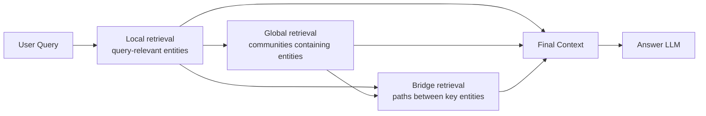

The main implementation gap we focused on was bridge retrieval.

The baseline HiRAG bridge is query-aware when it selects entities, but mostly topology-driven when it chooses paths. In other words, after key entities are selected, the path itself is usually a normal shortest path. That can prefer graph-short but semantically weak routes.

Our working hypothesis was:

> HiRAG's local/global bridge can be improved if path selection is conditioned on the query, not just on graph distance.

## What We Implemented

We added experimental retrieval modes to the active `main.py` + `src/hirag/` path.

| Mode | Local Retrieval | Bridge Retrieval | Purpose |
|---|---|---|---|
| `hi` | Dense entity retrieval | Unweighted shortest path | Baseline control |
| `hi_weighted` | Dense entity retrieval | Query-weighted Dijkstra | Prefer query-relevant bridge edges |
| `hi_minmax` | Dense entity retrieval | Minimize worst edge cost | Avoid one very bad bridge edge |
| `hi_rerank` | FastEmbed late-interaction reranking | Unweighted shortest path | Improve seed entities |
| `hi_rerank_weighted` | FastEmbed late-interaction reranking | Query-weighted Dijkstra | Combine reranking and weighted paths |

We also added supporting tooling:

- deterministic retrieval benchmark: `eval/retrieval_context_benchmark.py`
- cluster-balance analyzer: `eval/analyze_cluster_balance.py`
- bridge coverage diagnostics:
  - bridge vs local token recall
  - bridge vs global token recall
  - bridge vs query token overlap
- GMM hardening for duplicate/collapsed embeddings and covariance failures
- analysis notebooks:
  - `notebooks/retrieval_q50_metrics_overview.ipynb`
  - `notebooks/retrieval_q50_case_studies.ipynb`

## New Retrieval Architecture

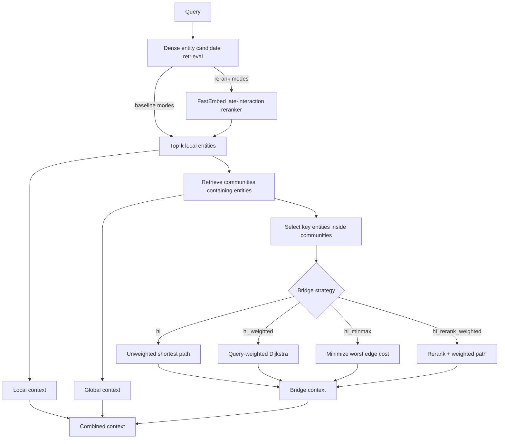

## Query-Weighted Bridge Cost

For weighted and minmax modes, each graph edge is scored against the query.

The edge text is built from:

```text
source entity name
source entity description
edge description
target entity name
target entity description
```

Then the edge cost combines semantic relevance, hub penalty, and relation weight:

```text
edge_cost =
  alpha * semantic_cost
  + beta * normalized_hub_penalty
  + gamma * inverse_weight_penalty
```

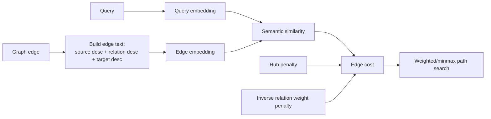

This changes bridge retrieval from "shortest graph path" to "best query-conditioned path."

## q50 Benchmark

We ran 50 agriculture queries against the existing agriculture ultra-lean graph artifact.

Command:

```bash
uv run python eval/retrieval_context_benchmark.py \
  --working-dir .runs/2026-04-22-agri-resume2/graphs/benchmark_ultra_lean_run1_20260422_204326 \
  --query-file eval/datasets/agriculture/agriculture_query.jsonl \
  --query-limit 50 \
  --output-dir .runs/retrieval_eval/dev_retrieval_q50
```

Output files:

- `.runs/retrieval_eval/dev_retrieval_q50/metrics.csv`
- `.runs/retrieval_eval/dev_retrieval_q50/contexts.jsonl`
- `.runs/retrieval_eval/dev_retrieval_q50/summary.md`
- `.runs/retrieval_eval/dev_retrieval_q50/summary.json`

## q50 Results

| Variant | Latency | Context Tokens | Bridge Edges | Path Edges | Local Recall | Global Recall | Query Overlap |
|---|---:|---:|---:|---:|---:|---:|---:|
| `hi` | 0.0569 | 29,826.6 | 205.52 | 250.56 | 0.6456 | 0.3601 | 0.6285 |
| `hi_weighted` | 3.0468 | 29,898.0 | 207.66 | 252.32 | 0.6465 | 0.3571 | 0.6455 |
| `hi_minmax` | 9.2689 | 32,411.5 | 277.10 | 369.88 | 0.6752 | 0.3930 | 0.6677 |
| `hi_rerank` | 0.6931 | 29,790.0 | 195.02 | 238.08 | 0.6046 | 0.3594 | 0.6354 |
| `hi_rerank_weighted` | 0.9844 | 29,886.7 | 197.42 | 239.50 | 0.6100 | 0.3598 | 0.6443 |

Metric meanings:

- `Local Recall`: token overlap between bridge context and local entity context.
- `Global Recall`: token overlap between bridge context and global community context.
- `Query Overlap`: token overlap between bridge context and the query.
- `Path Edges`: number of graph path edges before final bridge truncation/ranking.
- `Bridge Edges`: number of edge items retained in bridge context.

## Interpretation

### `hi_weighted`

`hi_weighted` gives a mild improvement:

- query overlap improves from `0.6285` to `0.6455`
- local recall is almost unchanged
- global recall is slightly lower

This says query-weighted Dijkstra is useful, but not enough by itself.

### `hi_minmax`

`hi_minmax` is the strongest quality signal:

- local recall improves from `0.6456` to `0.6752`
- global recall improves from `0.3601` to `0.3930`
- query overlap improves from `0.6285` to `0.6677`
- average max edge cost is lower than weighted Dijkstra

But the cost is high:

- context grows from `29.8k` to `32.4k` tokens
- bridge edges grow from `205` to `277`
- path edges grow from `251` to `370`
- latency grows to about `9.27s`

The important conclusion is:

> Minmax path selection finds cleaner bridge routes, but the naive version lets paths get too long.

### `hi_rerank`

`hi_rerank` is mixed:

- bridge size decreases
- query overlap slightly improves
- local recall drops from `0.6456` to `0.6046`

This means late-interaction reranking changes the local seed entities, but deterministic context metrics do not prove it is better yet.

### `hi_rerank_weighted`

`hi_rerank_weighted` is compact and somewhat query-aligned:

- bridge edges are lower than baseline
- query overlap improves from `0.6285` to `0.6443`
- local recall drops

This might be useful as a cheaper compact variant, but it is not currently the strongest research result.

## Main Tradeoff

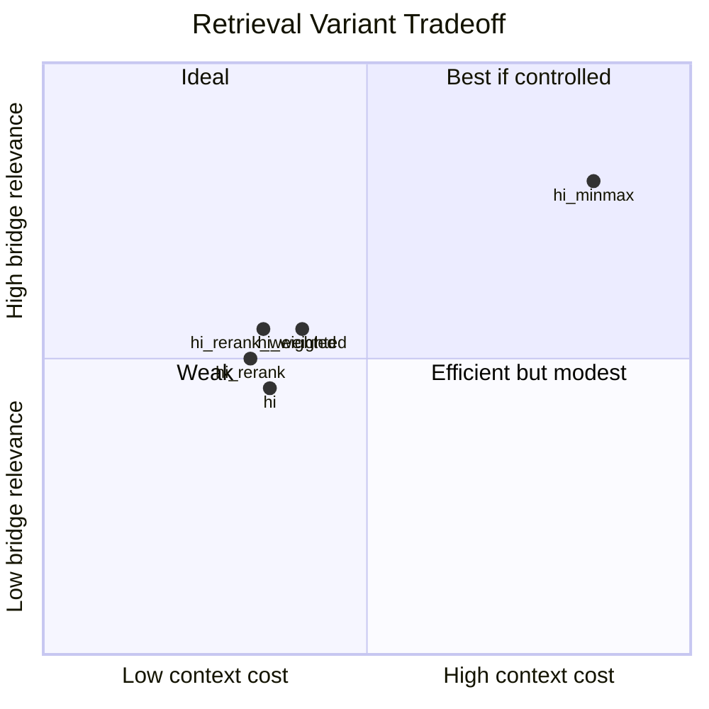

This chart is conceptual, not exact numeric scaling. The point is:

- `hi_minmax` gives the strongest bridge relevance signal.
- `hi_minmax` also has the worst context/latency cost.
- `hi_rerank_weighted` is more compact, but its quality signal is weaker.

## Is This Promising?

Yes, with a precise scope.

The result is not:

> Every experimental mode beats baseline.

The result is:

> Query-conditioned bridge retrieval helps, especially minmax path selection, but the current minmax variant needs a retrieval budget.

That is a good project direction because it directly improves the paper's central bridge idea.

## Recommended Next Step: Budgeted Minmax

Current minmax:

> Avoid bad edges, even if paths get long.

Desired minmax:

> Avoid bad edges, but stay within a path/context budget.

Possible constraints:

- `bridge_max_path_edges`
- `bridge_max_total_edges`
- `bridge_length_penalty`
- `bridge_token_budget`
- `max_path_edges_per_pair`

Simple first design:

```text
Use minmax threshold search.
Reject candidate paths longer than L.
If no valid path under L exists, fall back to weighted Dijkstra.
If weighted Dijkstra also fails or exceeds budget, fall back to baseline shortest path.
```

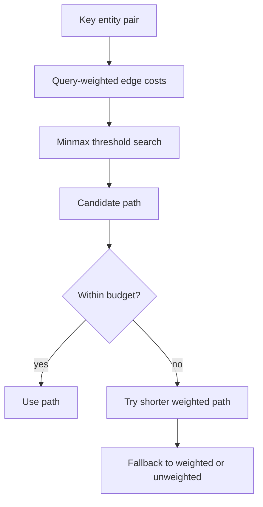

Alternative scoring version:

```text
score(path) =
  max_edge_cost(path)
  + lambda_length * normalized_path_length
  + lambda_tokens * estimated_bridge_tokens
```

This should preserve the useful part of minmax while controlling path bloat.

## Other Next Improvements

### 1. Persist Edge Embeddings

The first weighted query embeds graph edge texts. On the agriculture graph, this produced a large first-query cost.

We should cache:

```text
graph_id + embed_model + edge_key -> edge_embedding
```

Benefits:

- faster repeated q50/q100 runs
- cleaner latency measurement
- easier comparison across variants

### 2. Candidate-Subgraph Edge Costs

Instead of scoring all graph edges, score only edges near retrieved entities/communities.

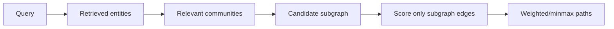

This would reduce compute and may reduce irrelevant paths.

### 3. Top-k Diverse Paths

The current bridge creates one ordered chain through key entities. That may be brittle.

Alternative:

- retrieve multiple compact paths
- rerank paths by relevance and diversity
- stop when bridge budget is full

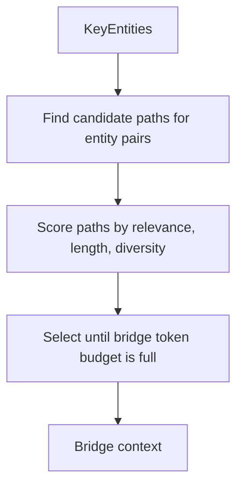

This could improve coverage without forcing one long chain.

### 4. Bridge Compression

If minmax paths are useful but long, compress the bridge before final context.

Options:

- keep only top scoring path edges
- remove generic intermediate nodes
- collapse repeated high-level summary nodes
- summarize long path segments

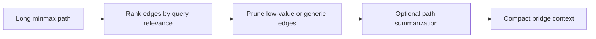

### 5. Simple Adaptive Retrieval Controller

Do not use RL yet. Use heuristic routing first.

Example:

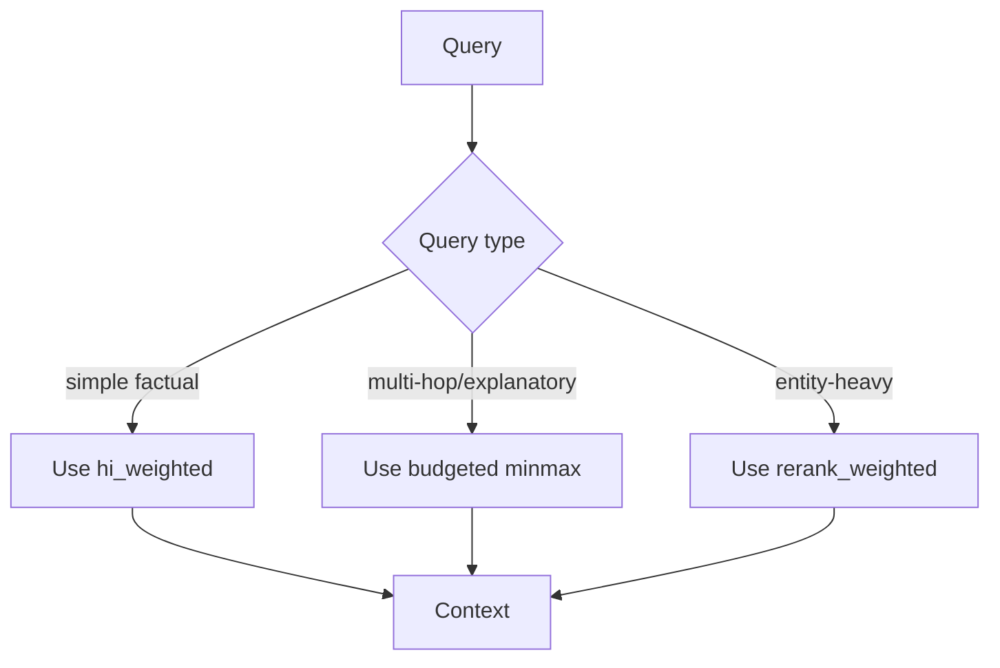

Possible query features:

- query length
- number of named entities
- whether query asks "why/how/compare"
- dense retrieval confidence
- number of communities triggered

### 6. Better Local Reranking

The current reranker uses entity text:

```text
entity name
type
description
```

This may be too sparse. Improve reranking text with:

- top source chunk snippets
- community titles
- relation descriptions
- entity neighborhood summaries

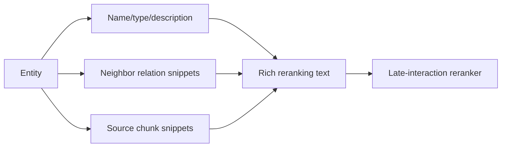

### 7. Hybrid Local Retrieval

Combine dense, lexical, and late-interaction retrieval:

- dense entity retrieval
- BM25 over entity descriptions
- ColBERT/FastEmbed reranking
- reciprocal rank fusion

This addresses the fact that local retrieval is the first domino for both global and bridge retrieval.

### 8. Community Reranking

Communities are currently selected by membership overlap with local entities. We can rerank community reports against the query.

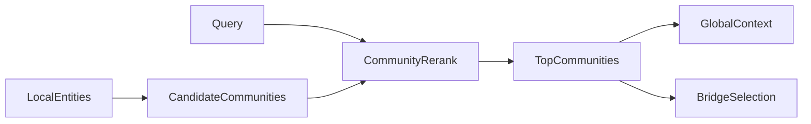

This may improve global context without changing graph construction.

### 9. Second-Pass Clustering / Self-Balancing Hierarchy

This remains interesting, but should not be the immediate next coding task.

The cluster-balance analyzer found many oversized/high-entropy communities, but the first split prototype proposed only one GMM cluster. This suggests type entropy alone is not enough.

Better split signals:

- embedding variance
- GMM confidence
- GMM top-1/top-2 margin
- source-document distribution
- relation-type entropy
- query failure cases

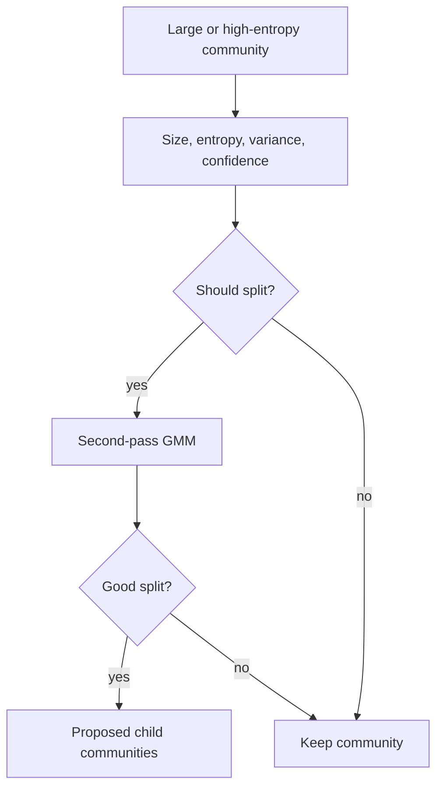

### 10. Answer-Level Evaluation

The current q50 metrics are context/path diagnostics. They are useful, but they are not final answer quality.

Next evaluation should generate answers for:

- `hi`
- `hi_weighted`
- `hi_minmax`
- `hi_minmax_budgeted`
- maybe `hi_rerank_weighted`

Then compare against references using:

- token F1
- exact match where applicable
- semantic similarity
- optional LLM-as-judge

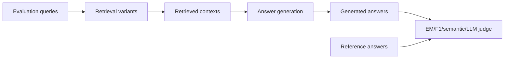

## Current Implementation Update

The next implementation step is now in place:

- `hi_minmax_budgeted` exists as an experimental query mode.
- Weighted bridge edge embeddings are persisted on disk in `.runs/edge_embedding_cache/`.
- Answer-level generation, pairwise judging, and blind human-annotation packet scripts exist under `eval/`.
- A one-query agriculture smoke generated answers for `hi` and `hi_minmax_budgeted`, judged them in both answer orders, and produced a human packet.

The first answer-level smoke is only a pipeline check. It is too small to claim a result, but it is important because it moves us beyond proxy-only context metrics.

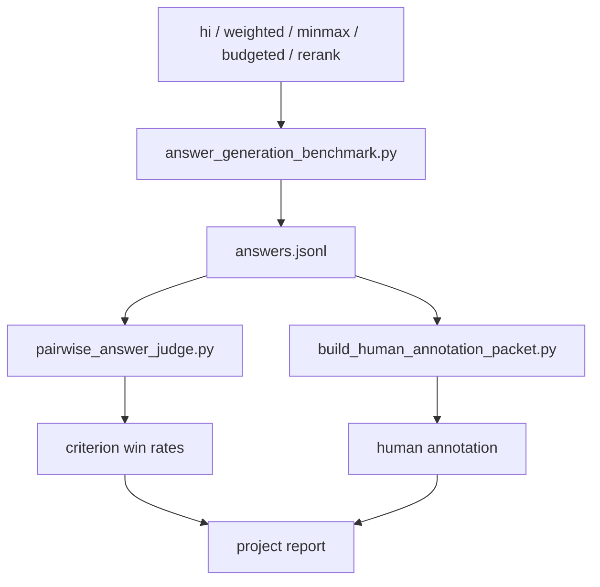

## Context Bloat Diagnosis

The first q30 local answer run stalled after 21 rows because several prompts exceeded the local vLLM model's 12,288-token context window. The issue was mostly retrieval/context packaging, not the user questions.

Observed bloat sources:

- q50 context metrics were around 30k tokens per request before answer-generation compaction.
- bridge paths, especially minmax variants, can add many relationship rows.
- community reports are verbose.
- source chunks are large; under small text budgets they were sometimes dropped entirely, which saves tokens but hurts evidence coverage.

Implemented mitigation:

- answer-eval context is now built separately before generation
- the prompt token count is estimated before calling the model
- budgets can shrink adaptively
- source chunks are retained as bounded snippets using `text_unit_snippet_chars`
- answer generation has explicit `answer_max_tokens` and request timeout
- `eval/retrieval_budget_sweep.py` sweeps compact regimes

Current best starting point:

```text
top_k=12
top_m=6
local/global/bridge section budgets=1000 tokens
text-unit retrieval budget=6000 tokens
source snippet cap=1200 chars
answer_max_tokens=512
max_input_tokens=9000
```

On a 3-query smoke, this `small` regime stayed under budget while retaining source snippets:

- `hi`: mean input ~4.4k tokens
- `hi_minmax_budgeted`: mean input ~5.5k tokens
- `hi_rerank_weighted`: mean input ~4.0k tokens

This is a much better answer-eval shape than the original ~30k-token contexts.

## Recommended Project Plan From Here

1. Run q30 answer generation with:
   - `hi`
   - `hi_weighted`
   - `hi_minmax`
   - `hi_minmax_budgeted`
   - `hi_rerank_weighted`
2. Judge q30 locally first, then repeat with an external judge if available.
3. Build the 30-query blind human annotation packet.
4. Rerun q50 or q100 context metrics including `hi_minmax_budgeted` now that edge embeddings are cached.
5. Update notebooks with the answer-level win rates and proxy-vs-judge comparisons.
6. Pick 2-3 qualitative examples from the notebooks.
7. Write the project report around this claim:

> HiRAG's bridge retrieval can be improved by query-conditioned path selection. Minmax path selection improves local/global/query bridge alignment, but must be budgeted to avoid context bloat.

## Best Research Story

The strongest story is:

> HiRAG correctly identifies the need for bridge knowledge between local entities and global communities. However, the baseline bridge path is still too topology-driven. We make bridge retrieval query-conditioned using weighted and minmax path search. Experiments show minmax improves bridge alignment with local, global, and query context, but increases path length. We therefore propose budgeted minmax as the next refinement: keeping query-relevant paths while controlling retrieval cost.
